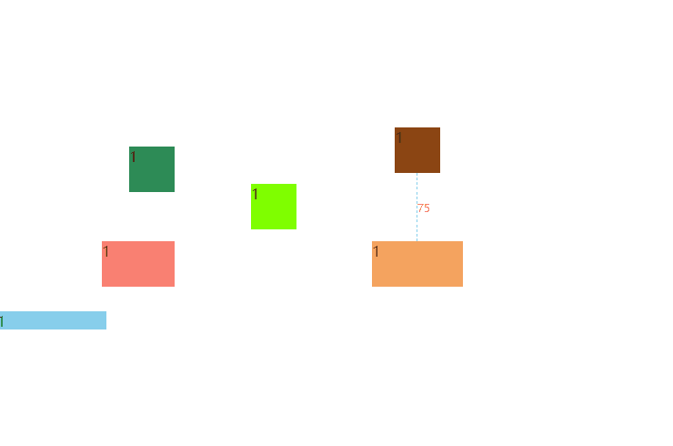

# snap-line
[](https://github.com/PinghuaZhuang/snap-line/actions/workflows/publish.yml) [](https://github.com/PinghuaZhuang/snap-line/blob/master/LICENSE) [](https://github.com/PinghuaZhuang/snap-line/commits/master) [](https://www.npmjs.com/package/@zstark/snap-line)

拖动元素, 创建辅助线, 帮助对齐.



## Example

[LiveDemo](https://pinghuazhuang.github.io/snap-line/)

## 🚀 Quick Start

```javascript
import SnapLine from './src/SnapLine.js';

let boxes = Array.from(document.querySelectorAll('.box'));
let snap = new SnapLine();

boxes.forEach((item) => {
  let drag = new Dragify(item);
  item.innerHTML = window.devicePixelRatio;

  drag
    .on('start', () => {
      snap.generateGrid('.box');
    })
    .on('move', () => {
      snap.check(drag.$elem, '.box');
    })
    .on('end', () => {
      snap.uncheck();
    });
});
```

### 创建带有标尺

```javascript
import SnapLine from './src/SnapLine.js';
let boxes = Array.from(document.querySelectorAll('.box'));
let snap = new SnapLine({
  onSnap(params) {
    const { direction, targetRect } = params;
    const [mins, container] = snap.nearest(params);
    mins.forEach(({ distance: min, token, config }, mini) => {
      let guideLine = container.querySelector(`[data-type="${mini}"]`);
      const prop = direction === 'h' ? 'width' : 'height';
      if (!guideLine) {
        guideLine = document.createElement('div');
        guideLine.classList.add('snap-line-guide');
        guideLine.dataset.type = mini.toString();
        container.appendChild(guideLine);
      }
      if (min === Infinity) {
        guideLine.dataset.distance = '';
        guideLine.style[prop] = `0px`;
        return;
      }
      guideLine.style[prop] = `${min}px`;
      guideLine.dataset.distance = min > 10 ? min.toString() : '';
      guideLine.style[
        direction === 'h' ? 'left' : 'top'
      ] = `${config.getPosition(token, targetRect)}px`;
    });
  },
  noStyle: true,
});

boxes.forEach((item) => {
  let drag = new Dragify(item);
  item.innerHTML = window.devicePixelRatio;

  drag
    .on('start', () => {
      snap.generateGrid('.box');
    })
    .on('move', () => {
      snap.check(drag.$elem, '.box');
    })
    .on('end', () => {
      snap.uncheck();
    });
});
```

```css
.snap-line {
  opacity: 0.7;
  position: absolute;
  pointer-events: none;
  z-index: 1000;
  display: none;
}

.snap-line[data-direction='h'] {
  transform: translateY(-1px);
  width: 100%;
  height: 1px;
  left: 0;
}

.snap-line[data-direction='v'] {
  transform: translateX(-1px);
  width: 1px;
  height: 100%;
  top: 0;
}

.snap-line-guide {
  width: 100%;
  height: 100%;
  position: absolute;
  color: red;
  text-align: center;
  font-size: 12px;
}

.snap-line-guide::after {
  content: attr(data-distance);
}

.snap-line[data-direction='h'] .snap-line-guide {
  border-top: 1px dashed #4daeff;
}
.snap-line[data-direction='v'] .snap-line-guide {
  border-left: 1px dashed #4daeff;
}
.snap-line[data-direction='v'] .snap-line-guide::after {
  height: 100%;
  display: flex;
  align-items: center;
}
```
